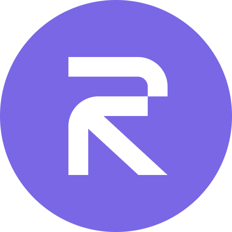

# Rise Dash 🎮

A modern 2D platform game built with Next.js, TypeScript, and Web3 integration. Jump over sushi obstacles, shoot rice rockets, and compete on the blockchain leaderboard in this addictive endless runner!



## ✨ Features

### 🎮 **Core Gameplay**

- **Canvas-based 2D gameplay** with smooth 60fps animations
- **Physics system** with realistic gravity and jump mechanics
- **Sushi obstacles** with dynamic collision detection
- **Rice rocket shooting** system for combat and obstacle destruction
- **Endless runner** gameplay with increasing difficulty
- **Distance tracking** and real-time scoring system

### 🌐 **Web3 Integration**

- **Wallet connection** with RainbowKit and Wagmi
- **Blockchain authentication** using Sign-In with Ethereum (SIWE)
- **On-chain leaderboard** with smart contract integration
- **Score verification** and blockchain storage
- **Rise Testnet** integration for decentralized features

### 🎨 **User Experience**

- **Multi-language support** (English, Spanish, French)
- **Responsive design** optimized for desktop and mobile
- **Dark theme** with gradient backgrounds
- **Smooth animations** and visual feedback
- **Accessibility features** with keyboard navigation

### 🏆 **Social Features**

- **Global leaderboard** with blockchain-verified scores
- **User profiles** with game statistics
- **Achievement system** (coming soon)
- **Social sharing** of high scores

## 🚀 Quick Start

### Prerequisites

- **Node.js** 18.0 or higher
- **npm** or **yarn** package manager
- **MetaMask** or any Web3 wallet
- **Rise Testnet** configured in your wallet

### Installation

```bash
# Clone the repository
git clone <repository-url>
cd rise-dash

# Install dependencies
npm install

# Set up environment variables
cp .env.example .env.local
# Edit .env.local with your configuration

# Start development server
npm run dev
```

Open [http://localhost:3000](http://localhost:3000) in your browser to play!

### Environment Variables

Create a `.env.local` file in the root directory:

```env
# NextAuth Configuration
NEXTAUTH_URL=http://localhost:3000
NEXTAUTH_SECRET=your-secret-key-here

# Blockchain Configuration
NEXT_PUBLIC_RISE_TESTNET_RPC=https://rpc.testnet.rise.xyz
NEXT_PUBLIC_CONTRACT_ADDRESS=your-contract-address
```

## 🎯 How to Play

### **Getting Started**

1. **Connect Wallet**: Click the "Connect Wallet" button and sign in with your Web3 wallet
2. **Authenticate**: Sign the SIWE message to verify your wallet ownership
3. **Start Game**: Press `ARROW UP` or `SPACEBAR` to begin

### **Gameplay Controls**

- **Jump**: Press `ARROW UP` to make your character jump over sushi obstacles
- **Shoot**: Press `SPACEBAR` to fire rice rockets (during gameplay)
- **Pause**: Press `ESC` to pause the game
- **Restart**: Press `ARROW UP` or `SPACEBAR` after game over

### **Objective**

- **Avoid obstacles**: Stay away from sushi enemies - touching them ends the game!
- **Shoot enemies**: Use rice rockets to destroy obstacles and earn points
- **Survive**: Travel as far as possible to increase your distance score
- **Compete**: Submit your score to the blockchain leaderboard

### **Navigation**

- **Game**: Main gameplay screen
- **Profile**: View your statistics and achievements
- **Leaderboard**: See global rankings and your position
- **Instructions**: Learn game controls and tips
- **Language**: Switch between English, Spanish, and French

## 🏗️ Project Architecture

```
src/
├── app/                    # Next.js App Router
│   ├── layout.tsx         # Root layout with providers
│   ├── page.tsx           # Home page with game
│   ├── profil/            # User profile page
│   ├── leaderboard/       # Global leaderboard
│   ├── instructions/      # Game instructions
│   └── api/               # API routes
├── components/             # React components
│   ├── game/              # Game-related components
│   │   ├── Game.tsx       # Main game component
│   │   ├── GameCanvas.tsx # Canvas rendering
│   │   ├── GameScreen.tsx # Game UI wrapper
│   │   └── ScoreBoard.tsx # Score display
│   ├── auth/              # Authentication components
│   │   ├── AuthButton.tsx # Wallet connection
│   │   └── WelcomeScreen.tsx # Landing page
│   ├── layout/            # Layout components
│   │   ├── Header.tsx     # Navigation header
│   │   └── PageLayout.tsx # Page wrapper
│   └── ui/                # Reusable UI components
├── hooks/                 # Custom React hooks
│   ├── useGameLoop.ts     # Game loop management
│   ├── useKeyboardControls.ts # Input handling
│   ├── useAuthSync.ts     # Authentication sync
│   └── useTranslations.ts # Internationalization
├── services/              # External services
│   └── blockchainService.ts # Smart contract interaction
├── store/                 # State management (Zustand)
│   └── languageStore.ts   # Language preferences
├── utils/                 # Game logic and utilities
│   ├── gameLogic.ts       # Core game mechanics
│   ├── gameRenderer.ts    # Canvas rendering logic
│   └── renderers/         # Specific renderers
├── types/                 # TypeScript interfaces
├── languages/             # Translation files
└── constants/             # Game configuration
```

## 🛠️ Development

### Available Scripts

```bash
# Development
npm run dev          # Start development server with Turbopack
npm run build        # Build for production
npm run start        # Start production server

# Code Quality
npm run lint         # Run ESLint
npm run lint:fix     # Fix ESLint issues

# Testing
npm run test         # Run tests
npm run test:watch   # Run tests in watch mode
npm run test:coverage # Generate test coverage report
```

### Key Technologies

- **[Next.js 15](https://nextjs.org/)** - React framework with App Router
- **[TypeScript](https://www.typescriptlang.org/)** - Type-safe JavaScript
- **[Tailwind CSS](https://tailwindcss.com/)** - Utility-first CSS framework
- **[Zustand](https://zustand-demo.pmnd.rs/)** - Lightweight state management
- **[Wagmi](https://wagmi.sh/)** - React hooks for Ethereum
- **[RainbowKit](https://www.rainbowkit.com/)** - Wallet connection UI
- **[NextAuth.js](https://next-auth.js.org/)** - Authentication with SIWE
- **[Hardhat](https://hardhat.org/)** - Ethereum development environment
- **[Jest](https://jestjs.io/)** - Testing framework
- **Canvas API** - 2D graphics rendering

## 🧪 Testing

The project includes comprehensive test coverage:

```bash
# Run all tests
npm test

# Watch mode for development
npm run test:watch

# Generate coverage report
npm run test:coverage
```

Test files are located alongside their respective source files in `__tests__/` directories.

## 🌐 Deployment

### Vercel (Recommended)

```bash
# Install Vercel CLI
npm install -g vercel

# Deploy
vercel

# Set environment variables in Vercel dashboard
```

### Manual Deployment

```bash
# Build the application
npm run build

# Start production server
npm start
```

### Environment Variables for Production

Set these environment variables in your deployment platform:

```env
NEXTAUTH_URL=https://your-domain.com
NEXTAUTH_SECRET=your-production-secret
NEXT_PUBLIC_RISE_TESTNET_RPC=https://rpc.testnet.rise.xyz
NEXT_PUBLIC_CONTRACT_ADDRESS=your-deployed-contract-address
```

## 🎮 Game Features Deep Dive

### **Physics System**

- Realistic gravity simulation
- Smooth jump mechanics with variable height
- Collision detection with pixel-perfect accuracy
- Momentum and velocity calculations

### **Rendering Engine**

- 60fps canvas rendering
- Optimized sprite management
- Smooth animations and transitions
- Responsive scaling for all screen sizes

### **Blockchain Integration**

- Real-time score submission
- Gas-optimized smart contracts
- Decentralized leaderboard
- Wallet-based authentication

## 🚧 Roadmap

### **Phase 1 - Enhanced Gameplay** 🎯

- [ ] Multiple obstacle types and patterns
- [ ] Power-ups and special abilities
- [ ] Different game modes (Time Attack, Survival)
- [ ] Boss battles and mini-games

### **Phase 2 - Social Features** 🌐

- [ ] Achievement system with NFTs
- [ ] Tournament mode with prizes
- [ ] Social sharing and challenges
- [ ] Guild/clan system

### **Phase 3 - \_\_\_\_ ** ⚡

## 🤝 Contributing

We welcome contributions! Here's how you can help:

1. **Fork** the repository
2. **Create** a feature branch (`git checkout -b feature/amazing-feature`)
3. **Commit** your changes (`git commit -m 'feat: Add amazing feature'`)
4. **Push** to the branch (`git push origin feature/amazing-feature`)
5. **Open** a Pull Request

### Development Guidelines

- Follow TypeScript best practices
- Update documentation as needed
- Follow the existing code style

## 📄 License

This project is open source and available under the [MIT License](LICENSE).

## 🙏 Acknowledgments

- **Rise Protocol** for blockchain infrastructure
- **Next.js team** for the amazing framework
- **RainbowKit** for wallet integration
- **All contributors** who make this project better

---

**Ready to play?** 🎮 [Start your journey now!](http://localhost:3000)
